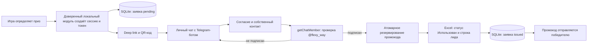

# Telegram-бот Flexy Way: механика, настройка и эксплуатация

Документ описывает фактически реализованную локальную связку:

**игра → одноразовая ссылка/QR-код → Telegram-бот → проверка подписки → SQLite → Excel → выдача промокода**.

Состояние документа: 15 августа 2026 года. Интеграция генерации ссылки непосредственно в игру будет выполнена отдельным этапом; сам бот, локальная база, Excel и выдача призов уже подготовлены.

## 1. Что настроено сейчас

| Компонент | Текущее значение |
|---|---|
| Telegram-бот | `@flexy_way_prize_bot` |
| Ссылка на бота | `https://t.me/flexy_way_prize_bot` |
| Проверяемый канал | `@flexy_way` |
| Ссылка на канал | `https://t.me/flexy_way` |
| Режим работы | локальный `long polling`, без публичного сервера и входящего порта |
| Рабочая Excel-книга | `Flexy_Way_промокоды.xlsx` в корне проекта |
| Локальная база | `telegram_bot/data/flexy_way_bot.sqlite3` |
| Локальный ключ | `telegram_bot/data/local_secret.key` |
| Конфигурация | `.env` в корне проекта |
| Python-окружение | `telegram_bot/.venv` |
| Логи | `telegram_bot/logs/bot.stdout.log` и `telegram_bot/logs/bot.stderr.log` |
| Часовой пояс записей Excel | `Europe/Moscow` |
| Срок действия обычной ссылки | 24 часа |
| Срок хранения контактных данных | 30 дней |
| Режим персональных данных в Excel | `masked` — номер маскируется, имя и username не записываются |
| Обязательная подписка | включена и принудительно проверяется кодом |
| Ограничение активности | 20 действий пользователя в минуту; до 6 проверок подписки в минуту |
| Лимит выдачи | один Telegram-аккаунт — один приз |
| Исключение для тестирования | `@RRedactor` может получать несколько тестовых выдач |

На момент подготовки документа бот запущен локально и подключён к Telegram. В базе синхронизировано **2403 промокода по 13 типам призов**. Проверка безопасности проходит полностью, автоматические тесты: **12 из 12 успешно**.

Токен Telegram-бота хранится только в локальном `.env`. В этом документе токен намеренно не указан.

## 2. Общая архитектура



Роли компонентов разделены следующим образом:

- **игра** определяет результат, передаёт код типа приза и уникальный ID игровой сессии;
- **SQLite** хранит состояния заявок, блокирует повторное использование ссылок и атомарно резервирует коды;
- **Excel** является понятным менеджеру реестром доступных и уже выданных промокодов;
- **Telegram Bot API** принимает действия пользователя, получает его собственный контакт и проверяет факт подписки;
- **бот** координирует процесс, но не подписывает пользователя автоматически, не пишет в канал и не делает рассылки.

## 3. Полная механика от победы до выдачи

### 3.1. Игра определяет тип приза

Игра должна работать не с текстом вроде «Приз №3», а со стабильным кодом приза из Excel, например:

```text
SUB-L1-04-10
```

Для каждой попытки игра создаёт уникальный ID сессии. Пример:

```text
visionbox-20260815-terminal01-round000123
```

Один и тот же ID сессии нельзя использовать для разных призов. Это защита от повторной регистрации выигрыша.

### 3.2. Создаётся одноразовая Telegram-ссылка

До подключения игры ссылка создаётся локальной командой:

```powershell
.\telegram_bot\.venv\Scripts\python.exe -m telegram_bot token `
  --prize SUB-L1-04-10 `
  --session visionbox-20260815-terminal01-round000123 `
  --json
```

Результат содержит:

- ID сессии;
- код и название приза;
- время истечения;
- непрозрачный случайный токен;
- готовую ссылку вида `https://t.me/flexy_way_prize_bot?start=fw_...`.

Важное отличие от первоначальной идеи `prize_3_Token9982`: текущий токен **не содержит номер или название приза**. По ссылке невозможно понять или заменить выигрыш. Приз определяется только по серверной записи в локальной базе.

Стандартный срок ссылки — 24 часа. Допустимый диапазон — от 1 до 168 часов:

```powershell
.\telegram_bot\.venv\Scripts\python.exe -m telegram_bot token `
  --prize SUB-L1-04-10 `
  --session test-session-001 `
  --ttl-hours 1
```

### 3.3. Игра показывает QR-код

Игра должна закодировать в QR **готовое поле `deep_link`**, возвращённое доверенным модулем. Рядом отображаются название приза и понятная инструкция:

> Чтобы получить приз, откройте Telegram по QR-коду, передайте свой номер телефона и подтвердите подписку на официальный канал Flexy Way.

Условие подписки необходимо показывать до начала участия или как минимум до определения результата, а не впервые после победы.

### 3.4. Пользователь открывает `/start` с токеном

Telegram передаёт боту команду:

```text
/start fw_...
```

Бот проверяет:

1. формат параметра;
2. существование токена в SQLite;
3. срок действия;
4. отсутствие отмены;
5. принадлежность первому открывшему Telegram-аккаунту;
6. отсутствие другого активного или уже выданного приза у этого Telegram ID.

При первом корректном открытии ссылка закрепляется за Telegram-аккаунтом. Другой аккаунт уже не сможет получить приз по этой ссылке. Повторное открытие тем же пользователем безопасно и продолжает текущую заявку.

Обычный Telegram-аккаунт может иметь только одну активную заявку и получить только один приз за всё время существования рабочей базы. После первой выдачи новые ссылки для этого Telegram ID отклоняются. Удаление контактных данных не снимает лимит: в базе остаётся необратимая ссылка пользователя и обезличенный факт выдачи.

Аккаунт с username `@RRedactor` является настроенным исключением для тестирования. Сравнение username выполняется без учёта регистра. Исключение действует только пока этот уникальный Telegram username принадлежит тестировщику; перед передачей или сменой username параметр в `.env` нужно изменить либо удалить.

### 3.5. Пользователь даёт согласие

Бот показывает:

- название выигранного приза;
- необходимость передать номер для связи по призу;
- необходимость подтвердить подписку;
- ссылку на описание обработки данных через `/privacy`;
- кнопки «Согласен и продолжить» и «Отказаться и удалить заявку».

До явного согласия бот не сохраняет профиль и не принимает номер телефона.

До согласия также показываются общие условия:

> Все призы действуют только для новых клиентов (кроме абонементов — они распространяются на всех клиентов).
>
> Призом можно воспользоваться только после пробного занятия.
>
> Приз можно использовать только один раз и только тому, кто его выиграл.
>
> Скидки и бонусы не суммируются с другими акциями.

### 3.6. Пользователь передаёт свой номер

После согласия появляется штатная Telegram-кнопка **«Поделиться номером»** с `request_contact=true`.

Защита на этом шаге:

- текстовый номер вручную не принимается;
- контакт другого человека не принимается;
- `contact.user_id` должен совпадать с Telegram ID отправителя;
- номер нормализуется к формату `+` и 7–15 цифр;
- в SQLite номер сохраняется зашифрованным;
- в Excel записывается только маска, например `+•••••••1234`.

### 3.7. Пользователь подписывается и запускает проверку

Бот показывает две кнопки:

- **«Подписаться на канал»** — обычная ссылка на `https://t.me/flexy_way`;
- **«Проверить подписку»** — явный запуск проверки пользователем.

После нажатия бот вызывает единственный запрос `getChatMember(@flexy_way, Telegram ID пользователя)`.

Подписка считается подтверждённой для статусов:

- `creator`;
- `administrator`;
- `member`;
- `restricted`, только если `is_member=true`.

Статусы `left` и `kicked` не проходят. Если подписка не найдена, промокод не резервируется и пользователь может подписаться и повторить проверку.

### 3.8. Промокод резервируется и записывается

После подтверждения подписки бот выполняет последовательность:

1. записывает время проверки подписки;
2. открывает в SQLite транзакцию `BEGIN IMMEDIATE`;
3. выбирает первый свободный промокод нужного типа по порядку строк Excel;
4. меняет его внутренний статус с `available` на `reserved`;
5. переводит заявку из `pending` в `issuing`;
6. атомарно обновляет рабочую Excel-книгу через временный файл;
7. повторно открывает Excel и проверяет, что запись действительно сохранена;
8. меняет статусы SQLite на `issued`;
9. отправляет пользователю приз, промокод и условия получения.

Непосредственно внутри транзакции бот повторно проверяет, что этому Telegram ID ещё не выдавался и сейчас не оформляется другой приз. Поэтому лимит нельзя обойти двумя почти одновременными нажатиями или ранее привязанной ссылкой. Для `@RRedactor` обе проверки сознательно пропускаются.

Если Excel открыт и заблокирован Microsoft Excel, код останется зарезервированным за той же заявкой. Бот попросит закрыть файл и повторить проверку. При повторе второй код не выдаётся.

### 3.9. Финальное сообщение

Пользователь получает:

- подтверждение подписки;
- название приза;
- конкретный промокод;
- условия применения из Excel;
- четыре общих условия получения;
- сообщение о связи менеджера;
- напоминание не пересылать код;
- команду `/delete_me`.

Для финального сообщения включён Telegram-параметр `protect_content=true`, ограничивающий штатную пересылку и сохранение сообщения.

## 4. Состояния заявок и промокодов

### Заявка победителя

| Статус | Значение |
|---|---|
| `pending` | ссылка создана, выдача ещё не завершена |
| `issuing` | конкретный промокод зарезервирован, идёт запись в Excel |
| `issued` | Excel и SQLite подтверждают выдачу |
| `expired` | срок ссылки истёк до завершения выдачи |
| `cancelled` | пользователь отказался или удалил незавершённую заявку |

### Промокод во внутренней базе

| Статус | Значение |
|---|---|
| `available` | доступен для автоматической выдачи |
| `reserved` | закреплён за конкретной заявкой, но процесс ещё не финализирован |
| `issued` | выдан ботом |
| `external_used` | в Excel уже был отмечен как использованный вне бота |
| `cancelled` | строка Excel имеет неподдерживаемый статус и не участвует в выдаче |

В Excel для обычной работы используются статусы **«Не использован»** и **«Использован»**.

## 5. Рабочая Excel-книга

Единственный рабочий файл, который читает и меняет бот:

```text
C:\Users\RocketPC\Desktop\TheMostCreative\Flexy Way — antigravity\Flexy_Way_промокоды.xlsx
```

Копии внутри `outputs` не являются рабочими файлами бота и автоматически не обновляются.

### Лист «Промокоды»

Бот читает обязательные колонки:

- `Код приза`;
- `Приз`;
- `Условия применения`;
- `Промокод`;
- `Статус`.

При выдаче обновляются:

- `Статус` → `Использован`;
- `Дата использования` → дата и время по Москве;
- `Получатель / клиент` → безопасная ссылка пользователя и маска телефона;
- `Комментарий` → отметка о Telegram-боте, безопасные ссылки заявки и сессии.

### Лист «Лиды Telegram»

Для каждой выдачи добавляется или идемпотентно обновляется строка:

- дата и время;
- `Telegram ref`;
- маска телефона;
- код и название приза;
- промокод;
- безопасные ссылки токена и сессии;
- статус `Выдан`;
- примечание о проверке подписки.

При текущем `EXCEL_PII_MODE=masked` поля username, имя и фамилия в Excel оставляются пустыми. Полные значения доступны только локально в зашифрованной SQLite-базе в течение установленного срока хранения.

### Важное правило работы с Excel

Во время выдачи рабочая книга должна быть закрыта в Microsoft Excel. Открытая книга может блокировать замену файла. Бот обработает это безопасно, но выдача потребует повторного нажатия «Проверить подписку» после закрытия Excel.

## 6. Локальная SQLite-база

Путь:

```text
telegram_bot/data/flexy_way_bot.sqlite3
```

Основные таблицы:

- `promo_inventory` — синхронизированный инвентарь промокодов и их внутренние статусы;
- `prize_tokens` — игровые сессии, токены, владельцы заявок, согласия, проверка подписки и выданные коды.

SQLite используется с настройками `WAL`, `synchronous=FULL`, `foreign_keys=ON`, `secure_delete=ON` и тайм-аутом блокировки. Транзакционное резервирование предотвращает выдачу одного промокода двум пользователям.

При каждом запуске бот сначала читает Excel и синхронизирует инвентарь с SQLite. Уже зарезервированные и выданные записи база не превращает обратно в свободные.

## 7. Защита персональных данных

На Windows применяются два механизма:

1. полный Telegram ID, телефон, username, имя, фамилия, токен и ID сессии шифруются через Windows DPAPI;
2. для поиска и отображения создаются необратимые HMAC-ссылки вида `tg_...`, `token_...`, `session_...`.

Файл `telegram_bot/data/local_secret.key` хранит защищённый мастер-ключ для стабильных ссылок. Удалять или заменять его нельзя: существующие записи перестанут корректно сопоставляться. Сами контактные значения дополнительно защищены контекстом Windows-пользователя, под которым запущен бот.

Контактные данные:

- удаляются по подтверждённой команде `/delete_me`;
- автоматически очищаются после 30 дней;
- проверяются при запуске и затем раз в сутки;
- после удаления заменяются в Excel текстом «Удалено по запросу»;
- факт уже совершённой выдачи и использованный промокод сохраняются обезличенно для защиты от повторной выдачи.

Команда для просмотра конкретного контакта менеджером требует уже выданный промокод:

```powershell
.\telegram_bot\.venv\Scripts\python.exe -m telegram_bot contact --promo PROMO-CODE
```

Не следует выгружать полную базу или массово расшифровывать контакты.

## 8. Фактическая конфигурация `.env`

В корневом `.env` сейчас явно заданы:

```dotenv
TELEGRAM_BOT_TOKEN=<секрет хранится локально>
TELEGRAM_BOT_USERNAME=flexy_way_prize_bot
TELEGRAM_CHANNEL_ID=@flexy_way
TELEGRAM_CHANNEL_URL=https://t.me/flexy_way
PROMOCODES_XLSX=Flexy_Way_промокоды.xlsx
BOT_DATABASE=telegram_bot/data/flexy_way_bot.sqlite3
BOT_TIMEZONE=Europe/Moscow
TOKEN_TTL_HOURS=24
POLLING_TIMEOUT_SECONDS=30
MANAGER_MESSAGE=Менеджер свяжется с вами в ближайшее время!
PRIZE_LIMIT_EXEMPT_USERNAME=RRedactor
```

Безопасные параметры, которые сейчас работают через значения по умолчанию в `config.py`:

```dotenv
BOT_DATA_SECRET=telegram_bot/data/local_secret.key
DATA_RETENTION_DAYS=30
EXCEL_PII_MODE=masked
SUBSCRIPTION_REQUIRED=true
ORGANIZER_NAME=Flexy Way
PRIVACY_CONTACT=@flexy_way
RATE_LIMIT_PER_MINUTE=20
```

`SUBSCRIPTION_REQUIRED=false` для этого проекта программно запрещён: бот не запустится с такой настройкой.

`PRIZE_LIMIT_EXEMPT_USERNAME` не отключает общее правило глобально. Он освобождает от лимита только Telegram-профиль с точно совпадающим уникальным username. Для публичной эксплуатации список исключений расширять не следует.

Файлы `.env`, `telegram_bot/data`, `telegram_bot/logs` и `telegram_bot/.venv` исключены из Git через `.gitignore`.

## 9. Настройки Telegram и права бота

Бот добавлен администратором канала `@flexy_way`, поэтому Telegram гарантированно разрешает проверять других участников через `getChatMember`.

Последняя проверенная конфигурация прав:

- статус: `administrator`;
- `can_manage_chat=true`;
- публикация сообщений: включена;
- редактирование сообщений: включено;
- удаление сообщений: включено;
- назначение других администраторов: выключено.

Для работы механики достаточно минимального административного статуса с `manage_chat`. После появления администратора канала нужно убрать лишние права публикации, редактирования и удаления, оставив только необходимый минимум. До этого момента ссылку на бота не следует массово распространять.

Дополнительно в @BotFather рекомендуется проверить:

```text
/setjoingroups → @flexy_way_prize_bot → Disable
```

Это запрещает добавлять бота в обычные группы.

Даже при временно лишних правах код бота содержит дополнительные ограничения:

- разрешены только методы `getMe`, `deleteWebhook`, `getUpdates`, `sendMessage`, `answerCallbackQuery`, `getChatMember`;
- методы публикации, редактирования, удаления, блокировки и назначения администраторов отсутствуют в разрешённом списке;
- `sendMessage` принимает только положительный ID личного чата;
- сообщения из групп и каналов игнорируются;
- бот не умеет делать массовые рассылки.

## 10. Риск ограничений Telegram и правила механики

Полностью гарантировать отсутствие автоматических ограничений Telegram невозможно. Обязательная подписка как условие выдачи остаётся чувствительным сценарием, поэтому используются следующие ограничения:

- только один официальный тематически связанный канал;
- реальный заранее определённый приз;
- условие подписки объявляется до участия;
- нет рефералов и приглашения друзей;
- нет автодобавления и автоподписки;
- проверка выполняется только после кнопки пользователя;
- нет массовых или рекламных рассылок;
- отписка после выдачи не аннулирует приз;
- номер не используется для рекламы без отдельного согласия;
- пользователь может удалить контактные данные.

Перед публичным запуском должны быть опубликованы настоящие правила розыгрыша и политика обработки данных с полным наименованием организатора, контактами, сроками и способом получения приза.

Актуальные правила Telegram: `https://telegram.org/tos/bot-developers`.

## 11. Установка и запуск

Все команды выполняются в PowerShell из корня проекта:

```powershell
Set-Location -LiteralPath 'C:\Users\RocketPC\Desktop\TheMostCreative\Flexy Way — antigravity'
```

### Первичная установка или обновление зависимостей

```powershell
.\telegram_bot\setup_bot.ps1
```

Скрипт:

1. создаёт `telegram_bot/.venv`;
2. устанавливает зафиксированные зависимости;
3. инициализирует SQLite и синхронизирует Excel;
4. выполняет проверку безопасности;
5. запускает 9 автоматических тестов.

Зависимости:

- `openpyxl==3.1.5`;
- `defusedxml==0.7.1`;
- `tzdata==2026.3`.

### Запуск в текущем окне

```powershell
.\telegram_bot\start_bot.ps1
```

Скрипт сначала выполняет `init` и `security-check`, затем запускает long polling. Для остановки используется `Ctrl+C`.

Одновременно может работать только один экземпляр. Второй процесс остановится с сообщением «Бот уже запущен в другом процессе». Блокировка хранится рядом с базой в файле `flexy_way_bot.sqlite3.run.lock`.

### Локальный фоновый запуск

```powershell
$project = 'C:\Users\RocketPC\Desktop\TheMostCreative\Flexy Way — antigravity'
$python = Join-Path $project 'telegram_bot\.venv\Scripts\python.exe'
$stdout = Join-Path $project 'telegram_bot\logs\bot.stdout.log'
$stderr = Join-Path $project 'telegram_bot\logs\bot.stderr.log'

Start-Process -FilePath $python `
  -ArgumentList '-m', 'telegram_bot', 'run' `
  -WorkingDirectory $project `
  -WindowStyle Hidden `
  -RedirectStandardOutput $stdout `
  -RedirectStandardError $stderr
```

При перезагрузке компьютера локальный процесс остановится. Автозапуск через Планировщик заданий Windows пока не настроен.

## 12. Команды обслуживания

### Синхронизировать Excel и создать структуру базы

```powershell
.\telegram_bot\.venv\Scripts\python.exe -m telegram_bot init
```

### Посмотреть остатки по типам призов

```powershell
.\telegram_bot\.venv\Scripts\python.exe -m telegram_bot prizes
```

### Посмотреть последние заявки в безопасном виде

```powershell
.\telegram_bot\.venv\Scripts\python.exe -m telegram_bot claims --limit 50
```

### Удалить просроченные персональные данные вручную

```powershell
.\telegram_bot\.venv\Scripts\python.exe -m telegram_bot cleanup
```

### Проверить безопасность настроек и хранения

```powershell
.\telegram_bot\.venv\Scripts\python.exe -m telegram_bot security-check
```

Ожидаемый результат — шесть строк `OK`:

- шифрование персональных данных;
- отсутствие старых открытых токенов;
- маскирование Excel;
- обязательная подписка;
- короткий срок QR-ссылки;
- автоматическое удаление данных.

### Запустить тесты

```powershell
.\telegram_bot\.venv\Scripts\python.exe -m unittest discover -s telegram_bot/tests -v
```

Проверяются истечение токена, полный сценарий выдачи, идемпотентность, шифрование и удаление данных, запрет чужого контакта, привязка ссылки к первому аккаунту, лимит одного приза, повторная транзакционная проверка лимита, исключение `@RRedactor`, совместимость с рабочим Excel и блокировка опасных методов Telegram API.

## 13. Логи и диагностика

Просмотр последних строк:

```powershell
Get-Content .\telegram_bot\logs\bot.stdout.log -Tail 50
Get-Content .\telegram_bot\logs\bot.stderr.log -Tail 50
```

При временной недоступности Telegram бот не завершается: используется повтор с увеличивающейся задержкой от 1 до 30 секунд. Аналогичная логика действует для long polling.

Типовые ситуации:

| Симптом | Причина и действие |
|---|---|
| Бот не отвечает | проверить, запущен ли локальный процесс, интернет и последние строки обоих логов |
| «Ссылка недействительна» | токена нет в базе или параметр повреждён; создать новую ссылку |
| «Срок действия ссылки истёк» | создать новую заявку с новым ID сессии |
| «Уже привязан к другому аккаунту» | ссылку первым открыл другой Telegram-пользователь; передать случай организатору |
| Подписка не находится | проверить фактическую подписку, `@flexy_way` в `.env` и наличие бота среди администраторов канала |
| «Excel-файл занят» | закрыть рабочую книгу и повторно нажать проверку; тот же код останется закреплён |
| «Свободные коды закончились» | добавить промокоды нужного типа в Excel со статусом «Не использован», закрыть Excel и выполнить `init` |
| «Бот уже запущен» | второй процесс не нужен; использовать уже работающий экземпляр или корректно остановить его |

## 14. Подключение к игре — следующий этап

Сейчас генерация ссылок доступна через CLI. Для интеграции с игрой нужно добавить доверенный локальный мост между игровым приложением и Python-модулем.

Рекомендуемый контракт:

```json
{
  "session_id": "visionbox-20260815-terminal01-round000123",
  "prize_code": "SUB-L1-04-10"
}
```

Ответ:

```json
{
  "session_id": "visionbox-20260815-terminal01-round000123",
  "prize_code": "SUB-L1-04-10",
  "prize_name": "Название из Excel",
  "expires_at": "UTC-время",
  "deep_link": "https://t.me/flexy_way_prize_bot?start=fw_..."
}
```

Требования к интеграции:

- токен создаётся только доверенной серверной или локальной частью, не JavaScript-клиентом браузера;
- клиент не должен иметь возможности подменить `prize_code`;
- ID игровой сессии уникален и создаётся до показа QR;
- игра может определить новый выигрыш, но бот всё равно отклонит его, если этот Telegram ID уже получил приз;
- повторный запрос для той же сессии и того же приза возвращает существующую активную заявку;
- ссылка и QR показываются только конкретному победителю;
- сырые токены не пишутся в публичные логи;
- локальный HTTP-мост, если он понадобится, должен слушать только `127.0.0.1` и проверять секрет приложения;
- игра должна обрабатывать отсутствие кодов и ошибку локальной базы без обещания недоступного приза.

Не следует генерировать строку `fw_...` самостоятельно на стороне игры: простого случайного текста недостаточно, потому что заявка обязана существовать в SQLite и быть связана с реальным типом приза.

## 15. Резервное копирование и восстановление

Для согласованной резервной копии нужно остановить бота и сохранить вместе:

- `Flexy_Way_промокоды.xlsx`;
- `telegram_bot/data/flexy_way_bot.sqlite3`;
- возможные `flexy_way_bot.sqlite3-wal` и `flexy_way_bot.sqlite3-shm`;
- `telegram_bot/data/local_secret.key`;
- `.env` — отдельно в защищённом хранилище.

Excel, SQLite и `local_secret.key` должны относиться к одному моменту времени. Копировать только одну базу без WAL-файлов во время работы процесса нельзя.

Перенос зашифрованных контактов на другой компьютер или под другую учётную запись Windows отдельно не предусмотрен. Для обычного реестра выданных призов остаётся маскированный Excel.

## 16. Чек-лист перед публичным запуском

- [ ] Убрать у бота лишние права публикации, редактирования и удаления сообщений канала.
- [ ] Убедиться, что бот остаётся администратором `@flexy_way` и `getChatMember` работает.
- [ ] Проверить в @BotFather, что добавление в группы отключено.
- [ ] Внести полное название организатора и рабочий контакт в настройки и политику.
- [ ] Опубликовать правила розыгрыша и политику обработки данных.
- [ ] Показать условие подписки на экране правил до начала игры.
- [ ] Закрыть рабочую Excel-книгу.
- [ ] Запустить `security-check` и тесты.
- [ ] Проверить остатки командой `prizes`.
- [ ] Провести один полный тест: QR → согласие → контакт → подписка → Excel → промокод.
- [ ] Проверить вторую ссылку обычным аккаунтом: бот должен сообщить о лимите одного приза.
- [ ] Проверить несколько последовательных выдач аккаунтом `@RRedactor`.
- [ ] Проверить строку на листе «Лиды Telegram» и статус на листе «Промокоды».
- [ ] Настроить контролируемый запуск после перезагрузки Windows, если бот должен работать постоянно.

## 17. Карта файлов проекта

```text
.env                                  локальная конфигурация и токен
.gitignore                            исключение секретов, данных, логов и окружения
Flexy_Way_промокоды.xlsx              рабочий реестр промокодов и выдач
TELEGRAM_BOT_GUIDE.md                 этот документ
telegram_bot/
  __main__.py                         CLI-команды и запуск
  app.py                              пользовательский сценарий бота
  config.py                           чтение и валидация настроек
  database.py                         SQLite, статусы, транзакции и выдача
  workbook.py                         чтение и безопасное обновление Excel
  telegram_api.py                     ограниченный клиент Telegram Bot API
  security.py                         DPAPI, HMAC-ссылки и маскирование
  instance_lock.py                    запрет второго процесса
  setup_bot.ps1                       установка и полная проверка
  start_bot.ps1                       запуск с предварительными проверками
  README.md                           краткая техническая инструкция
  SECURITY.md                         чек-лист безопасности
  PRIVACY_POLICY.md                   проект политики обработки данных
  requirements.txt                    зафиксированные зависимости
  data/                               SQLite, ключ и файл блокировки
  logs/                               журналы фонового процесса
  tests/                              автоматические тесты
```

Главное эксплуатационное правило: **бот должен работать, Excel должен быть закрыт, а условие подписки и правила должны быть заранее видны участнику**.
